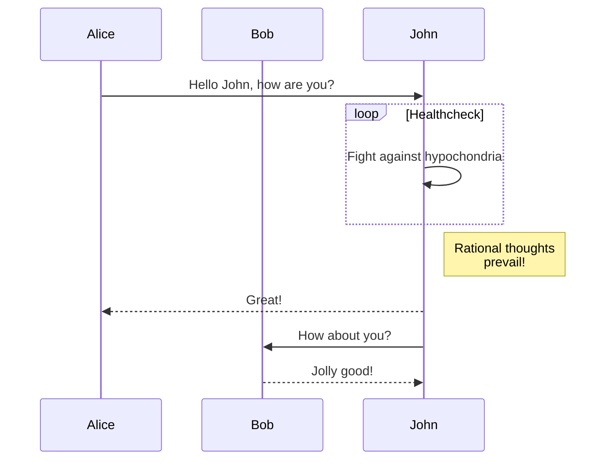

title: Getting started
slug: CsQg1xgwsxULdKjQBCXOW
createdAt: 2020-09-12T07:08:20.000Z
updatedAt: 2022-03-26T08:40:31.000Z
---

:::hint
## 👋 Welcome to Archbee!

We're stoked to have you here :)
:::

## 🎸 Get rolling with the editor

*   [ ] Click anywhere and start typing
*   [ ] Highlight any text, and use the menu to **style** *your *~~writing~~ `however` *you like;* or use Markdown shortcuts to format,* like ## or \*\** &#x20;
*   [ ] Go to a new row and type **/ **to add blocks; add anything from **lists,** **tables** to **diagrams** and **API docs **(OpenAPI or GraphQL) or embed [30+ other software ](https://www.archbee.io/integrations)like Figma, Loom, Airtable;
*   [ ] Go to a new row and type @ to link documents or mention people in your workspace
*   [ ] To the left are your collections, an easy way to hierarchically organize your docs
*   [ ] Collections can be shared on your own domain, and it looks like [docs.pathfix.com](https://docs.pathfix.com) or even our own docs [docs.archbee.io](https://docs.archbee.io).


>
>
> Now let's explore 
>
>

## ****💡 Diagrams

Below is a [mermaid diagram, markdown based](https://mermaid-js.github.io/mermaid/#/). Other options like native drag and drop diagrams are available as well, just type **/diagram **on a new line in the editor.



## 🔌  Endpoint docs

Below is a single endpoint descriptor. Great for webhooks.

## Get Cakes&#x20;

This endpoint allows you to get free cakes.

### Code examples

:::codeblocktabs
```curl
curl --request GET
  --url https://api.cakes.com/v1/cakes/:id 
  --header 'Accept: application/json'
```

```javascript
fetch("https://api.cakes.com/v1/cakes/:id", {
  "method": "GET",
  "headers": {
    "Accept": "application/json"
  }
})
.then(response => {
  console.log(response);
})
.catch(err => {
  console.error(err);
});
```

```nodejs
const fetch = require('node-fetch');

let url = 'https://api.cakes.com/v1/cakes/:id';
let options = {
  method: 'GET', 
headers: {
    Accept: 'application/json',
  }
};
fetch(url, options)
  .then(res => res.json())
  .then(json => console.log(json))
  .catch(err => console.error('error:' + err));
```

```python
import requests

url = "https://api.cakes.com/v1/cakes/:id"
headers = {"Accept": "application/json"}
response = requests.request("GET", url, headers=headers)
print(response.text)
```
:::

### Responses

:::codeblocktabs
```200
{
    "name": "Cake's name",
    "recipe": "Cake's recipe name",
    "cake": "Binary cake"
}
```

```404
{
    "message": "Ain't no cake like that."
}
```
:::

## ⌨️  Code blocks

:::codeblocktabs
```go
package main

import "fmt"
import "time"

func worker(done chan bool) {
    fmt.Print("working...")
    time.Sleep(time.Second)
    fmt.Println("done")
    done <- true
}

```

```csharp
/*
 * C# Program to Check Whether the Entered Year is a Leap Year or Not
 */
using System;
using System.Collections.Generic;
using System.Linq;
using System.Text;
 
namespace Program
{
    class leapyear
    {
        static void Main(string[] args)
        {
            leapyear obj = new leapyear();
            obj.readdata();
            obj.leap();
        }
        int y;
        public void readdata()
        {
            Console.WriteLine("Enter the Year in Four Digits : ");
            y = Convert.ToInt32(Console.ReadLine());
        }
        public void leap()
        {
            if ((y % 4 == 0 && y % 100 != 0) || (y % 400 == 0))
            {
                Console.WriteLine("{0} is a Leap Year", y);
            }
            else
            {
                Console.WriteLine("{0} is not a Leap Year", y);
            }
            Console.ReadLine();
        }
    }
}
```

```python
# Python3 program to demonstrate 
# the use of sample() function . 
  
# import random  
import random 
  
  
# Prints list of random items of 
# length 3 from the given list. 
list1 = [1, 2, 3, 4, 5, 6]  
print("With list:", random.sample(list1, 3)) 
  
# Prints list of random items of 
# length 4 from the given string.  
string = "GeeksforGeeks"
print("With string:", random.sample(string, 4)) 
  
# Prints list of random items of 
# length 4 from the given tuple. 
tuple1 = ("ankit", "geeks", "computer", "science", 
                   "portal", "scientist", "btech") 
print("With tuple:", random.sample(tuple1, 4)) 
  
  
# Prints list of random items of 
# length 3 from the given set. 
set1 = {"a", "b", "c", "d", "e"} 
print("With set:", random.sample(set1, 3)) 
```
:::

## 🌏 API Docs

You can add OpenAPI apis by typing `(swagger)`. You can also add GraphiQL allowing you to play with your GraphQL endpoints. Just type `(gql)` in the editor.&#x20;

## 💓 Changelogs

Need good looking changelogs?

## Version 2.1.13

*   **added** - Ability to foresee the future

*   **fixed** - Bug that took you too far into the past by 2 days

*   **improved** - Velocity of time rewind

*   **broken** - Broken time forward

*   **knownIssue** - You cannot stop time

## 📣 Callouts

Need to draw attention quickly?

:::hint
## 🔴 Danger

By philosophy, the library won't warn you when you modify your past, so you might delete your entire existence.
:::

:::hint
## 🔮 And of course, because it's the 2020s

Everything in this workspace is realtime!
:::

## 🧞‍♀️ We're great listeners, talk to us

👉 Have a question? Click the ? at the bottom right for guides or to send us a message.

